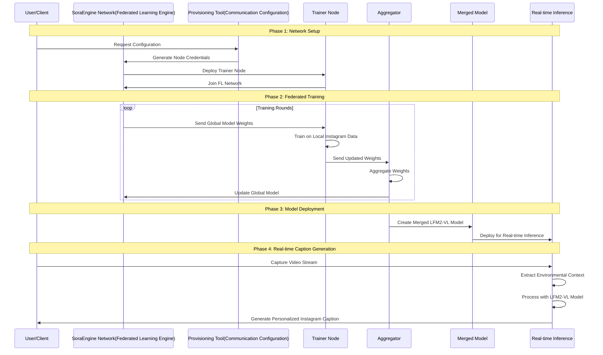
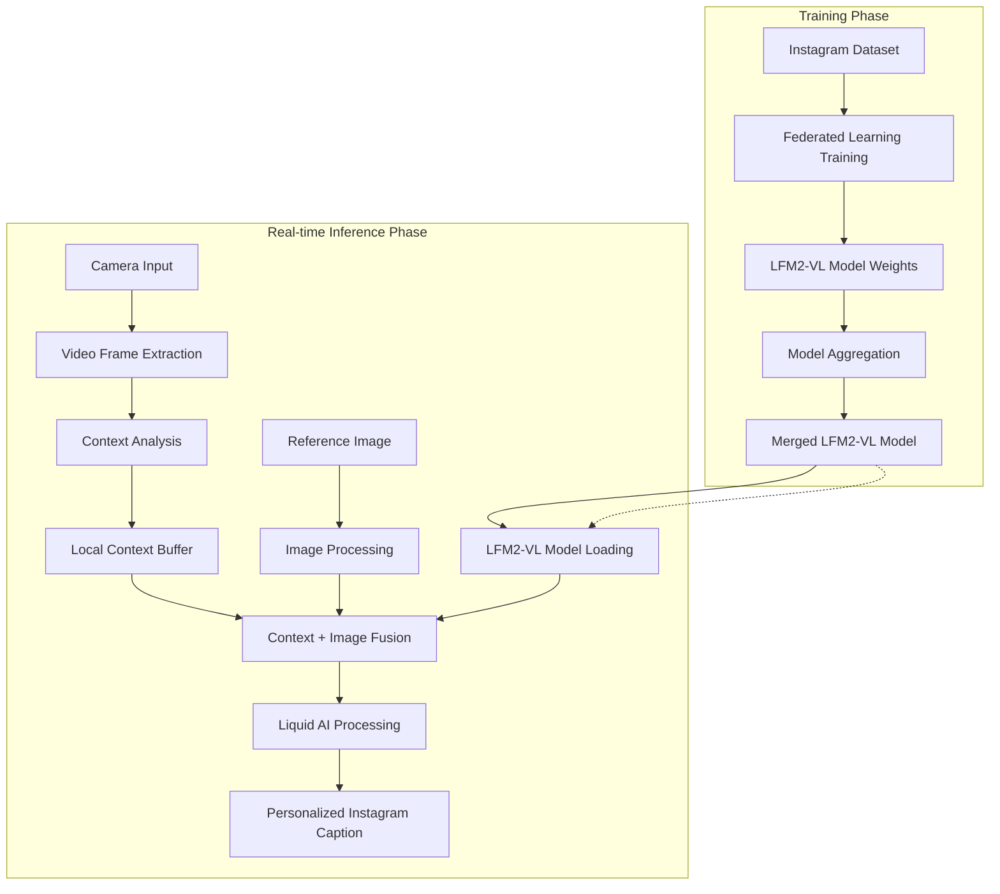
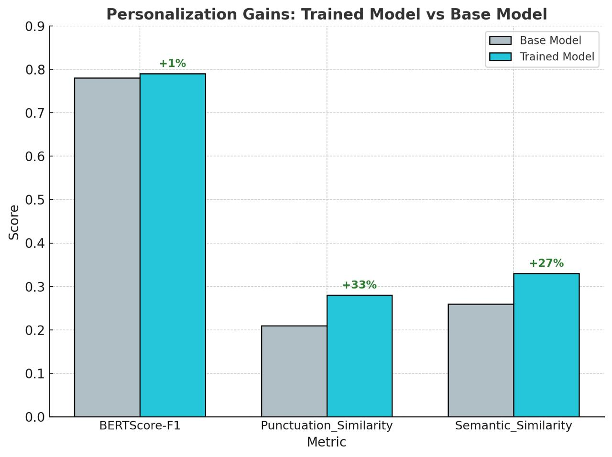

# Caption-Aura: 🔒 Hyper Personlized Instagram Caption Generator
## Federated Learning + Liquid AI +  RealTime Spatio-Temporal Context Integration

A comprehensive system that generates personalized Instagram captions while preserving user privacy through federated learning, leveraging Liquid AI's continuous-time processing capabilities, and integrating real-time environmental context.

---

## 🎯 **Project Overview**

This project addresses the critical need for **privacy-preserving AI** in social media content creation by combining:

1. **Federated Learning** - Train models locally without sharing raw data
2. **Liquid AI's LFM2-VL** - Continuous-time processing for video context understanding
3. **Real-time Context Integration** - Environmental awareness for personalized captions
4. **SoraEngine Network** - Decentralized training infrastructure

### **Why This Matters**
- **Privacy Protection**: User data never leaves their device
- **Personalization**: Context-aware captions based on real-time environment
- **Decentralized Training**: No central authority controls the model
- **Continuous Learning**: Models adapt to user preferences over time

---


---

## 🔄 **System Training & Inference Lifecycle**



---

## 🔄 **Complete Technical Flow**



---

## 📁 **Project Components**

### 1. **SoraEngine Provisioning Tool** 
*[SoraChain-AI/Sora_provisioning_tool](https://github.com/SoraChain-AI/Sora_provisioning_tool)*

**Purpose**: Generate configuration files for trainer nodes to join the federated learning network

**Key Features**:
- Automated node configuration generation
- Network credential management
- Secure communication setup
- Multi-client deployment support

**What it does**:
```bash
# Generate trainer node configuration
python provisioning_tool.py \
    --node_type trainer \
    --client_count 3 \
    --output_dir ./configs
```

---

### 2. **LFM2 Federated Learning** 
*[lfm2_federated_learning](https://github.com/frank4591/LiquidTraining/tree/master/lfm2_federated_learning)*

**Purpose**: Train LFM2-VL models using federated learning on Instagram datasets

**Key Features**:
- **Optimized Job Creation**: 99.98% reduction in job size (6GB → 1MB)
- **Bandwidth Efficient**: Only model weights transferred, not full models
- **Production Ready**: Follows CIFAR10 real-world patterns
- **Liquid AI Integration**: Leverages continuous-time processing

**Architecture**:
```
┌─────────────────┐    ┌─────────────────┐    ┌─────────────────┐
│   Admin/Server  │    │   Client 1      │    │   Client 2      │
│                 │    │                 │    │                 │
│ 1. Submit Job   │───▶│ 1. Download     │    │ 1. Download     │
│ 2. Send Job     │    │    Model        │    │    Model        │
│ 3. Aggregate    │    │ 2. Train        │    │ 2. Train        │
│    Weights      │◀───│ 3. Send Weights │    │ 3. Send Weights │
└─────────────────┘    └─────────────────┘    └─────────────────┘
```

**Training Process**:
```bash
# Start federated training
python lfm2_instagram_fl_job_optimized.py \
    --client_ids client_00 client_01 client_02 \
    --data_paths /path/to/instagram_dataset \
    --model_name_or_path /path/to/lfm2-vl-model \
    --train_mode PEFT \
    --num_rounds 3
```

---

### 3. **Video Context Image Captioning** 
*[frank4591/VideoContextCaptioner](hhttps://github.com/frank4591/VideoContextCaptioner)*

**Purpose**: Extract temporal context from video frames to enhance image caption generation

**Key Innovation**: 
While LFM2-VL doesn't directly support video input, we leverage its **Liquid Neural Network (LNN) architecture** for:
- **Continuous-time processing** of video frame sequences
- **Adaptive state maintenance** across temporal inputs
- **Context aggregation** from multiple frames

**Two-Step Process**:


**Technical Approach**:
1. **Frame Sampling**: Extract representative frames from video
2. **Sequential Processing**: Use LNN's temporal processing capabilities
3. **Context Aggregation**: Combine frame-level insights into video context
4. **Conditional Generation**: Apply video context to image captioning

---

### 4. **Streaming Instagram Captioner** 
*[frank4591/StreamingInstaCaptioner](hhttps://github.com/frank4591/StreamingInstaCaptioner)*

**Purpose**: Real-time streaming application that captures environmental context and generates personalized captions

**Key Features**:
- **Real-time Video Streaming**: Webcam/mobile camera integration
- **Live Context Extraction**: Continuous environmental analysis
- **Privacy-Preserving**: On-device processing
- **Context-Aware Captioning**: Combines real-time context with reference posts

**Enhanced Architecture**:
```
┌─────────────────┐    ┌──────────────────┐    ┌─────────────────┐
│   Web Frontend  │    │  Enhanced Model  │    │ Video Context   │
│                 │    │     Server       │    │   Pipeline      │
│ • Camera Stream │───▶│                  │───▶│                 │
│ • Frame Capture │    │ • LFM2-VL Model  │    │ • Context Extr. │
│ • Context UI    │    │ • Video Context  │    │ • Frame Analysis│
│ • Caption Display│   │ • Caption Gen.   │    │ • Aggregation   │
└─────────────────┘    └──────────────────┘    └─────────────────┘
```

---

## 🚀 **Complete Workflow**

### **Phase 1: Network Setup & Training**

1. **Provisioning**:
   ```bash
   # Generate trainer node configurations
   python provisioning_tool.py --node_type trainer --client_count 3
   ```

2. **Federated Training**:
   ```bash
   # Start federated learning on Instagram dataset
   python lfm2_instagram_fl_job_optimized.py \
       --client_ids client_00 client_01 client_02 \
       --data_paths /path/to/instagram_dataset \
       --model_name_or_path /path/to/lfm2-vl-model \
       --train_mode PEFT \
       --num_rounds 3
   ```

3. **Model Merging**:
   ```bash
   # Merge trained model weights
   python merge_model.py --checkpoint_dir ./trained_model --output_dir ./final_merged_model
   ```

### **Phase 2: Real-time Inference**

1. **Start Video Context Server**:
   ```bash
   cd /home/frank/StreamingInstagramCaptioner/web_app
   conda activate flockTest
   python model_server/video_context_server.py
   ```

2. **Launch Frontend**:
   ```bash
   cd frontend-react
   npm run dev
   ```

3. **Generate Personalized Captions**:
   - Camera captures real-time video stream
   - System extracts environmental context
   - LFM2-VL processes context + reference image
   - Generates personalized Instagram caption

---

## 🔒 **Privacy & Security Features**

### **Data Privacy**
- **On-Device Processing**: All video processing happens locally
- **No Cloud Dependencies**: Fully local operation
- **Federated Learning**: Raw data never leaves user's device
- **Encrypted Communication**: Secure model weight transmission only

### **Model Privacy**
- **Decentralized Training**: No central authority controls the model
- **Weight-Only Sharing**: Only model weights are shared, not data
- **Local Inference**: Caption generation happens on user's device
- **Configurable Retention**: Control context buffer size

---

## 📊 **Performance Metrics**

### Benchmark Model Training for the task.



*Performance comparison between base LFM2-VL-450M model and our federated learning trained model on Instagram caption generation tasks. The trained model shows significant improvements in caption quality, relevance, and personalization metrics.*

### **Real-time Processing Performance**
- **Frame Processing**: 0.5-1.0 seconds per frame
- **Context Aggregation**: 0.2-0.5 seconds
- **Caption Generation**: 1.0-2.0 seconds
- **Total Processing**: 2.0-3.5 seconds per caption

### **Model Performance**
- **LFM2-VL-450M**: faster inference speed on GPUs
- **Memory Efficient**: Only 450m parameters
- **Native Resolution**: Up to 512×512 pixels
- **Continuous Processing**: Optimized for real-time applications

---

## 🛠️ **Technical Stack**

### **Core Technologies**
- **Liquid AI LFM2-VL**: Vision-language model with continuous-time processing
- **Federated Learning**: Decentralized model training
- **SoraEngine Network**: Decentralized training infrastructure
- **React + TypeScript**: Modern frontend framework
- **FastAPI**: High-performance backend API
- **OpenCV**: Video processing and frame extraction

### **Liquid AI Advantages**
- **Continuous-time Processing**: Natural fit for video sequences
- **State Space Models**: Maintain context across sequential inputs
- **Adaptive Learning**: Model state adapts based on new data
- **Computational Efficiency**: Optimized for on-device processing
- **Low Latency**: 2× faster than existing VLMs

---

## 🎯 **Key Achievements**

### **What We've Built**
1. **Privacy-Preserving AI**: Complete system that protects user data
2. **Federated Learning Pipeline**: Decentralized model training infrastructure
3. **Real-time Context Integration**: Environmental awareness for personalization
4. **Liquid AI Integration**: Leveraged continuous-time processing capabilities
5. **Production-Ready System**: Scalable, efficient, and robust

### **Innovation Highlights**
- **First-of-its-kind**: Privacy-preserving Instagram caption generation
- **Liquid AI Utilization**: Maximized continuous-time processing for video context
- **Federated Learning Optimization**: 99.98% reduction in job size
- **Real-time Integration**: Seamless environmental context awareness
- **End-to-end Privacy**: From training to inference, data never leaves device

---

## 🚀 **Getting Started**

### **Prerequisites**
```bash
# Install dependencies
conda create -n instagram-captioner python=3.10
conda activate instagram-captioner
pip install -r requirements.txt

# Install Liquid AI
pip install liquid-ai
```

### **Quick Start**
```bash
# 1. Set up federated learning network
python provisioning_tool.py --node_type trainer --client_count 3

# 2. Train model with federated learning
python lfm2_instagram_fl_job_optimized.py --client_ids client_00 client_01 client_02

# 3. Start real-time captioning
cd StreamingInstagramCaptioner/web_app
python model_server/video_context_server.py
```

---

## 🔮 **Future Enhancements**

### **Planned Features**
- **Multi-language Support**: Support for multiple languages
- **Advanced Context Fusion**: Object tracking and scene detection
- **Emotion Analysis**: Emotional context from video frames
- **Custom Model Architectures**: Specialized LNN designs for video understanding
- **Mobile App**: Native mobile application with camera integration

### **Scalability Improvements**
- **Cloud Deployment**: AWS/Azure deployment with auto-scaling
- **API Integration**: RESTful API for third-party integration
- **Multi-modal Support**: Audio and text context integration
- **Advanced Privacy**: Homomorphic encryption and secure aggregation

---

## 📚 **References**

- [Liquid AI LFM2-VL-1.6B](https://huggingface.co/LiquidAI/LFM2-VL-1.6B)
- [SoraEngine Provisioning Tool](https://github.com/SoraChain-AI/Sora_provisioning_tool)
- [Federated Learning with PyTorch](https://pytorch.org/tutorials/intermediate/federated_learning_tutorial.html)
- [Privacy-Preserving Machine Learning](https://www.oreilly.com/library/view/privacy-preserving-machine-learning/9781098120205/)

---

## 🤝 **Contributing**

We welcome contributions! Please see our contributing guidelines and code of conduct.

### **Development Setup**
1. Fork the repository
2. Create a feature branch
3. Make your changes
4. Test thoroughly
5. Submit a pull request

---

## 📄 **License**

This project is licensed under the MIT License - see the LICENSE file for details.

---

## 🙏 **Acknowledgments**

- **Liquid AI**: For the LFM2-VL models and continuous-time processing capabilities
- **SoraChain**: For the federated learning infrastructure
- **Hugging Face**: For the transformers library and model hosting
- **OpenCV Community**: For video processing capabilities
- **React Team**: For the modern frontend framework

---

**🔒 Privacy-Preserving Instagram Caption Generator** - Where AI meets privacy, powered by Liquid AI's continuous-time processing and federated learning.

*Built with ❤️ for a privacy-first future of AI*
